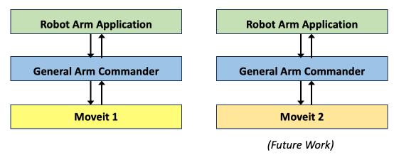
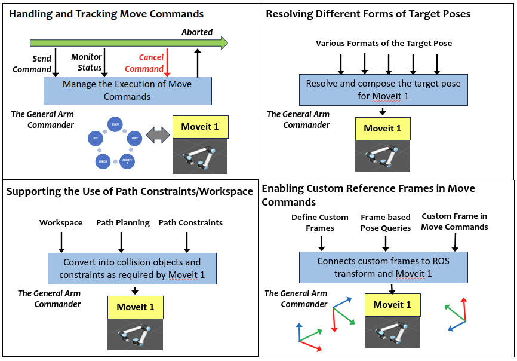
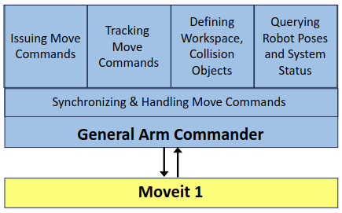

# The Arm Commander
 [](https://opensource.org/licenses/BSD-3-Clause)

<!--
Replace REPO_USER, & REPO_NAME in the lines below to get more auto-generated badges

[](./BSD.txt)
-->

The **Arm Commander** is a Python programming module for accelerating the development of robot arm manipulation applications. It provides programming access to general executing and tracking services for robot arm and end-effector manipulation. Application developers are spared from implementing the same services and primed for creating higher-level manipulation sequences. The programming effort can be significanly reduced.

The arm commander defines a model programming interface for general robot arm manipulation and comprises the components for mapping move commands between the application and the underlying robotic manipulation platforms or arm movement planners such as [Moveit](https://ros-planning.github.io/moveit_tutorials/). It is expected that applications based on the **Arm Commander** can switch between Moveit 1, Moveit 2, and other platforms almost seamlessly. The current version works with [Moveit 1](https://ros-planning.github.io/moveit_tutorials/) and ROS Noetic. A long-term objective is to attain manipulation platform angostic and robot model agnostic support of application development.

The arm commander is a critical component of the **Task Trees**, which is a SDK for building reusable and resilient behaviour tree-based robotic manipulation applications. Refer to the [Task Trees Github Repo](https://github.com/RAS-REF/task_trees) for the details.

The following figure the relation between the application, the arm commander, and the underlying robotic manipulation platform.



## Application Progamming with the Arm Commander

Application development can be made significantly simpler with the arm commander, which has implemented several processes essential in the interaction with the underlying robotic manipulation platform (i.e. Moveit). 



#### Handling and Tracking Move Commands

Applications can use the support of the arm commander to issue, track and abort move commands, and can alternatively delegate the tracking to the arm commander. The arm commander supports synchronoization and error recovery.

#### Resolving Different Forms of Target Pose

Applications can specify the target pose in different forms. generally, the target pose can be in the form of a `Pose` object, a `PoseStamped` object, a list of 6 numbers representing (xyzrpy) or 7 numbers representing (xyzqqqq). Its components, the `position` and the `rotation`, can be specified individually while the other component is fixed at the current value. In addition, each of the xyz components of the `position` or the rpy components of the `rotation` can also be specified individually. For example, the end-effector can be moved to a new position in the x axis, while the y axis, z axis, and the rotation will remain the same. The **Arm Commander** resolves and re-packages the move commands appropriately for the underlying Moveit 1. 

#### Supporting the Use of Workspace and Constraints

Applications can define the workspace to confine the end-effector within a 3D bounding box. They can also exploit helper functions to create various path constraints to regulate the joint status and the end-effector's pose during the execution of a move command.

#### Enabling Custom Reference Frames in Move Commands

Applications can define custom reference frames for specifying move commands relative to different local contexts.

### Design Patterns of Arm Commander-based Robotic Manipulation Applications 

The [Application Design Gallery](docs/DESIGN.md) page presents several probable designs of robotic manipulation applications based on the arm commander and a robotic manipulation platform. 

### Application Programming Interface (API)

The application programming interface (API) of the **Arm Commander** can be divided into three groups of functions:
- Issuing and tracking move commands 
- Defining the workspace, collision objects, and custom frames of reference
- Querying the status of the robot arm and the system



The [API Overview](docs/API_OVERVIEW.md) page has organized the available functions for browsing. The [Full API Documentation](https://REF-RAS.github.io/arm_commander/build/html/index.html) is also available for reference.

## Installation

The [Installation Guide](docs/INSTALL.md) describes a docker-based and a non-docker based procedures.

## The Demonstration Application

The demo application is located at `examples/commander_demo.py`. The demo requires a running Panda model on RViz.
```
roslaunch panda_moveit_config demo.launch
```
Then execute the demo application.
```
cd ~/arm_commander_ws
source devel/setup.bash
/usr/bin/python3 ./src/arm_commander/arm_commander/commander_demo.py
```
Click on the following link to watch the robot arm movement as directed by the demo application

[](https://www.youtube.com/watch?v=YleDRs649VA)


## Programming Tutorials

A set of tutorials and example programs are provided in this package.

- [Tutorial: Programming with the Arm Commander Package (Part 1)](docs/TUTORIAL_PART1.md)
- [Tutorial: Programming with the Arm Commander Package (Part 2)](docs/TUTORIAL_PART2.md)

## Links
- [Application Design Gallery](docs/DESIGN.md) 
- [API Overview](docs/API_OVERVIEW.md)
- [Installation Guide](docs/INSTALL.md)

## Authors

Dr Andrew Lui, Senior Research Engineer <br />
Dr Dasun Gunasinghe, Senior Research Engineer <br />
Robotics and Autonomous Systems, Research Engineering Facility <br />
Research Infrastructure <br />
Queensland University of Technology <br />

Latest update: Feb 2024
