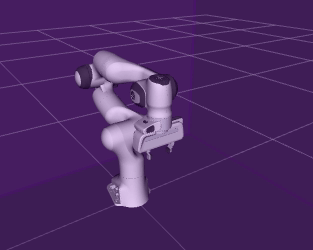

# The Arm Commander

 [](https://opensource.org/licenses/BSD-3-Clause)

**Robotics and Autonomous Systems Group, Research Engineering Facility, Research Infrastructure**
**Queensland University of Technology**

## Introduction

The **Arm Commander** is a Python programming module for accelerating the development of robot arm manipulation applications.  


Use the [Documentation Entry Point](http://REF-RAS.github.io/arm_commander) to bring you to following parts of the documentation of the arm commander.
- Overview of the Arm Commander
- Installation Guide
- Programming Tutorial Part 1
- Programming Tutorial Part 2
- Application Design Gallery
- Summary of the API

## Robot Arm Programming with the Arm Commander

The arm commander presents a programming interface dedicated to robot arm manipulation and encapsulates useful but tedious programming components such as ROS and arm movement planning.  The arm commander can support the development of applications using or not using ROS. The following example uses the arm commander API to move the end-effector of the robot arm `panda_arm` to the position (0.6, 0.0, 0.4), and then move it to another position (0.4, 0.2, 0.4)

```
from arm_commander.commander_moveit import GeneralCommander, GeneralCommanderFactory

class ArmCommanderMoveExample():
    def __init__(self):
        # create the General Commander and wait for it being ready to service move commands
        arm_commander: GeneralCommander = GeneralCommanderFactory.get_object('panda_arm')
        arm_commander.spin(spin_in_thread=True)
        arm_commander.wait_for_ready_to_move()
        # send two move commands one after another
        arm_commander.move_to_position(x = 0.6, y = 0.0, z = 0.4, wait=True)
        arm_commander.reset_state()
        arm_commander.move_to_position(x = 0.4, y = 0.2, wait=True)
        arm_commander.reset_state()
```


## Developers

Dr Andrew Lui, Senior Research Engineer <br />
Dr Dasun Gunasinghe, Senior Research Engineer <br />
Robotics and Autonomous Systems, Research Engineering Facility <br />
Research Infrastructure <br />
Queensland University of Technology <br />

Latest update: Feb 2024
