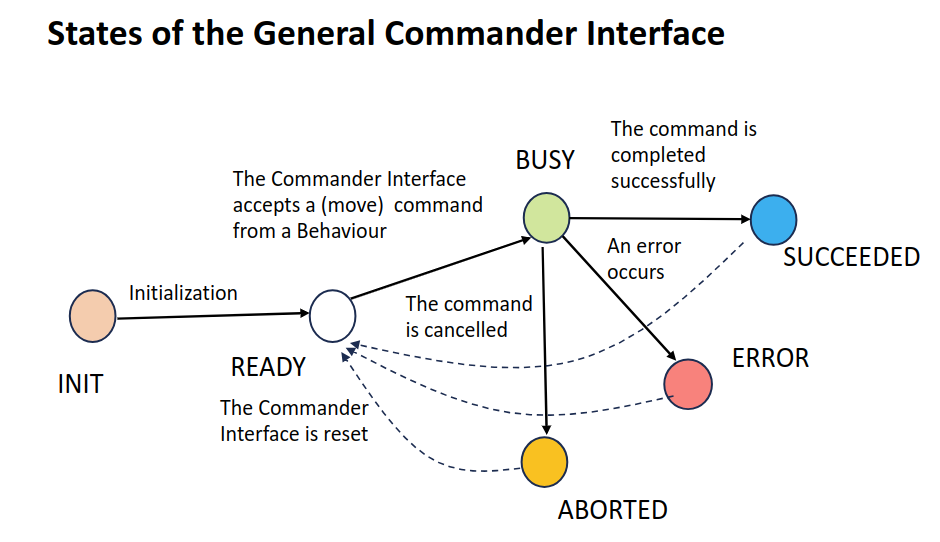
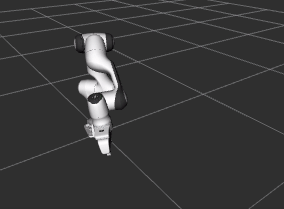

# Tutorial: Programming with the Arm Commander Package (Part 1)

Part 1 of the tutorial covers the basics of programming with arm commander package, including the first programs covering the essentials of the package and the primitive move commands.

## Requirements
- [Moveit 1](https://ros-planning.github.io/moveit_tutorials/) 
- ROS 1
- Python 3.8 or above

## Example Programs

Example programs are provided for illustrating how to use the **general arm commander** package in programming robot arm manipulations. They are can found under the directory `[Package Home]/examples`. The programs are divided into four sub-directories:
- `move`: examples on basic move commands and asynchronous programming support
- `framemove`: examples on move commands with custom reference frames
- `named_poses`: examples on move commands to named joint-space poses
- `collision`: examples on collision avoidance, collision objects, and path constraints.

## The Basics

The essential Python modules are found in the following three files.
- `commander_moveit.py`: defines main classes including the `GeneralCommander` and the factory class `GeneralCommanderFactory`.
- `states.py`: defines the key `Enum` classes for state management.
- `moveit_tools.py`: defines utility and helper functions.

### Import the Arm Commander in Python

To use the Python arm_commander interface, import the modules in the concerned Python program file as below.

```
from arm_commander.commander_moveit import GeneralCommander, GeneralCommanderFactory
from arm_commander.states import ControllerState, GeneralCommanderStates
import arm_commander.moveit_tools as moveit_tools
```

### The First Program

The program file `move/simple_move_1.py` illustrates the essentials of programming with the arm commander.

#### Create the General Arm Commander

The string parameter `panda_arm` specifies the __move_group__ as defined in the robot arm configuration (`panda_moveit_config`).

```
arm_commander: GeneralCommander = GeneralCommanderFactory.get_object('panda_arm')
arm_commander.spin(spin_in_thread=True)
arm_commander.wait_for_ready_to_move()
```

#### Important: The Threading Model

The GeneralCommander object must run in a different thread from the client that uses the object. The independent thread can be created as part of the call to the `spin()` function as shown below. 

```
arm_commander.spin(spin_in_thread=True)
```

Alternatively, the client can create a new thread and use it to execute the spin function. In this case, the parameter `spin_in_thread` should be False and the function call will __not__ return, as shown below.

```
class ArmCommanderMoveExample():
    def __init__(self):
        ...
        arm_commander: GeneralCommander = GeneralCommanderFactory.get_object('panda_arm')
        self.arm_commander = arm_commander
        self.the_thread = threading.Thread(target=self.spin_commander, daemon=True)
        self.the_thread.start()
        ...

    def spin_commander(self):
        self.arm_commander.spin(spin_in_thread=False)
```

#### Graceful Handling of Program Interrupts

As a good practice, client programs of the general arm commander should abort any move command before termination (whether self-induced or otherwise). The following is recommended.

```
class ArmCommanderMoveExample():
    def __init__(self):
        ...
        signal.signal(signal.SIGINT, self.stop)
        arm_commander: GeneralCommander = GeneralCommanderFactory.get_object('panda_arm')
        self.arm_commander = arm_commander
        ...

    def stop(self, *args, **kwargs):
        self.arm_commander.abort_move()
        self.arm_commander.clear_path_constraints() 
        self.arm_commander.reset_world()
```

#### Move to a XYZ Position

The function `move_to_position()` commands (the end-effector of) the arm to move to a position specified in XYZ. 
- The XYZ are specified as three component parameters.
- Their parameter values are defaulted to the current XYZ. In the second function call, the target of the move command is 
x (0.4), y (0.2) and the z will remain unchanged.
- The parameter `wait` specifies whether the move command is synchronous (True) or asynchronous (False). 
- A synchronous command call is blocking. The execution returns only after the command execution is completed.
- The function `reset_state()` must be called before issuing another move command to the general arm commander.

```
# send a move command
arm_commander.move_to_position(x = 0.6, y = 0.0, z = 0.4, wait=True)
arm_commander.reset_state()
# send a move command
arm_commander.move_to_position(x = 0.4, y = 0.2, wait=True)
arm_commander.reset_state()
```
The general arm commander uses states to regulate the interaction with the client program. For example, the state notifies the client if the 
command was successful or failed.
```
...
arm_commander.move_to_position(x = 0.4, y = 0.2, wait=True)
the_state = arm_commander.get_commander_state()
if the_state == GeneralCommanderStates.SUCCEEDED:
    print('The move was successful')
elif the_state in [GeneralCommanderStates.ABORTED, GeneralCommanderStates.ERROR]:
    print(f'Error: {arm_commander.get_error_code()}')
```

#### The States of the General Arm Commander

The following figure shows the states of the general arm commander and their significance to the client programs



### Asynchronous Commands

Specifying move commands asynchronously enables the execution of other tasks while the move command is being handled by the general arm commander. Set the parameter `wait` to False to signify that the command is asynchronous. The execution returns to the caller before the command is completed.

Addition logic is required for asynchronous move commands, such as a polling loop as below. The source code is from `simple_move_2.py`.

```
...
arm_commander.move_to_position(x = -0.6, y = 0.2, wait=False)        
while True:
    the_state = arm_commander.get_commander_state()
    if the_state not in [GeneralCommanderStates.BUSY]:
        break
    rospy.sleep(0.1)
arm_commander.reset_state()
...
```
Alternatively, use the function `wait_for_busy_end()` for a blocking wait of the end of the `BUSY` state.

#### Abort the Current Move Commands

The function `abort_move()` terminates the current move command. If the parameter `wait` is True, the function does not return until the abort has been
handled by the underlying platform completely and the state will become `GeneralCommanderStates.ABORTED`.

The following source code is from `simple_move_3.py`.
```
...
arm_commander.move_to_position(x = -0.6, y = 0.2, wait=False)
# abort the command after 3 seconds and wait for the abort to take effect
rospy.sleep(3.0)
arm_commander.abort_move(wait=True)
arm_commander.reset_state()
...
```

### Other Move to Position and Orientation Commands

#### Move using a displacement

The function `move_displacement()` commands the robot arm to move based on a displacement from the current position. The following source code is from `simple_move_4.py`.  The end-effector will move 10 cm ten times.
```
for step in range(10):
    arm_commander.move_displacement(dy = 0.1, wait=True)
    arm_commander.reset_state()
```
#### Rotate

The function `rotate_to_orientation()` commands the end-effector to rotate according to the given Euler's angles (roll, pitch, and yaw). The following source code is from `simple_move_4.py`. 
```
arm_commander.rotate_to_orientation(roll = 3.14, pitch = 0.0, yaw = 0.2, wait=True)
arm_commander.reset_state()
```
The default values of the three component parameters are the current values.

#### Move to Both Position and Orientation

The function `move_pose()` commands the end-effector to move to a target pose, which can be of type `Pose` or `PoseStamped`. 
```
pose = Pose()
pose.position.x = 0.4
pose.position.y = 0.2
pose.position.z = 0.6
pose.orientation.x = 0.0
pose.orientation.y = 0.0
pose.orientation.z = 0.0
pose.orientation.w = 1.0
arm_commander.move_to_pose(pose, wait=True)
arm_commander.reset_state()
```
The helper function `create_pose()` from the module `moveit_tools` offers conversion of a list of `xyzrpy` or `xyzqqqq` into `Pose` or `PoseStamped`.
The following source code is from `frame_move_1.py`.

```
xyzrpy = [0.4, 0.0, 0.4, 3.14, 0.0, 0.6]
arm_commander.move_to_pose(moveit_tools.create_pose(xyzrpy), wait=True)
arm_commander.reset_state() 
```



#### Cartesian Movement

The function `move_position()` supports both cartesian path planning (with collision avoidance) and algorithmic path planning (based on a path planner). 
Setting the parameter `cartesian` to True turns on cartesian path planning.  The following source code, found in`simple_move_5.py` compares the two
types of path planning.

```
# send a move command, z is defaulted to the current z value
rospy.loginfo(f'Go back to start')
arm_commander.move_to_position(x = 0.0, y = -0.5, z = 0.2, wait=True)            
arm_commander.reset_state()   

# send a move command moveing back to the original position, constrained cartesian movement
rospy.loginfo(f'From start to target (cartesian is True)')
arm_commander.move_to_position(x = 0.5, y = 0.0, z = 0.4, cartesian=True, wait=True)
arm_commander.reset_state()  
```

## Links

- [Overview: The Arm Commander Package](../README.md)
- [Tutorial: Programming with the Arm Commander Package (Part 2)](TUTORIAL_PART2.md)


## Author

Dr Andrew Lui, Senior Research Engineer <br />
Robotics and Autonomous Systems, Research Engineering Facility <br />
Research Infrastructure <br />
Queensland University of Technology <br />

Latest update: Feb 2024
