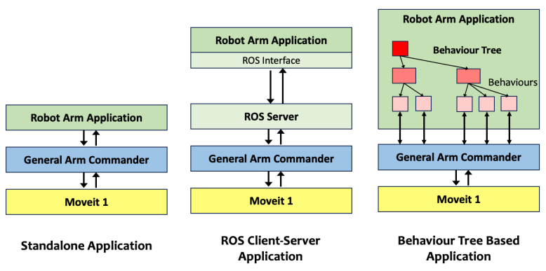
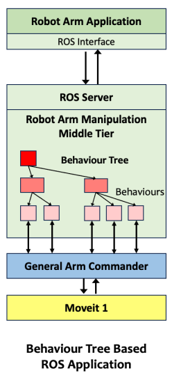

# Gallery of Application Designs 
 

## Application Design Patterns

This page describes several probable designs of a robotic manipulation application based on the arm commander and a robotic manipulation platform. 

### 1. Standalone Application

In a standalone application, the application issues move commands to the arm commander through function call. This design is suitable for applications that are expecting little modification and extension. 

### 2. ROS Client-Server Application

In a ROS-based client-server application, the application is divided into two layers, the ROS server that directly interacts with the arm commander, and the client-side ROS application that implements the high-level application logic.

This design is suitable for applications that expect changes in the high-level logic. The changes can be more or less localized on the client-side. The design facilitates more flexible allocation and sharing of computing resources.

### 3. Behaviour Tree-based Application

Behaviour trees is a highly effective model for implementing high-level non-trivial robotic manipulation. An behaviour tree-based application can define custom behaviour classes that interact with the arm commander in an asynchronous manner. The arm commander can inform a RUNNING behaviour the status of the active move command and offer the option to abort the command when the behaviour is stopped.

### 4. Behaviour Tree-based ROS Application

In a ROS application, a server-side behaviour trees can play the role of mapping high-level robotic manipulation tasks into low-level move actions. The client-side application can handle the high-level application logic such as executing a task that involves a sequence of behaviours in a behaviour tree branch.

### 5. Task Trees Framework-based Application

The [Task Trees Framework](https://github.com/REF-RAS/task_trees) is a software framework for easily exploiting bahaviour trees in applications. It offers a set of pre-defined versatile move behaviour classes for use in the current form or extension to a customized form. It also provides a skeleton behaviour tree called the task trees that has included the structure for initialization, identifying and executing tasks, and other priortized sequences.

The role of the application is further refined to task execution.

### Author

Dr Andrew Lui, Senior Research Engineer  
Robotics and Autonomous Systems, Research Engineering Facility  
Research Infrastructure  
Queensland University of Technology  

Latest update: Feb 2024
